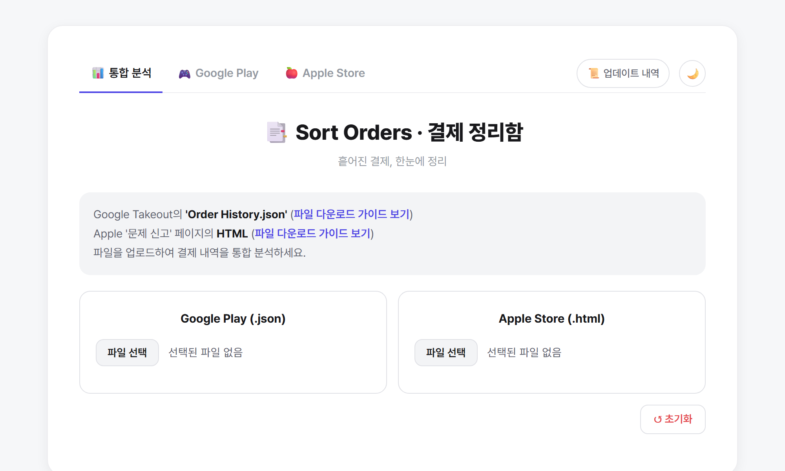
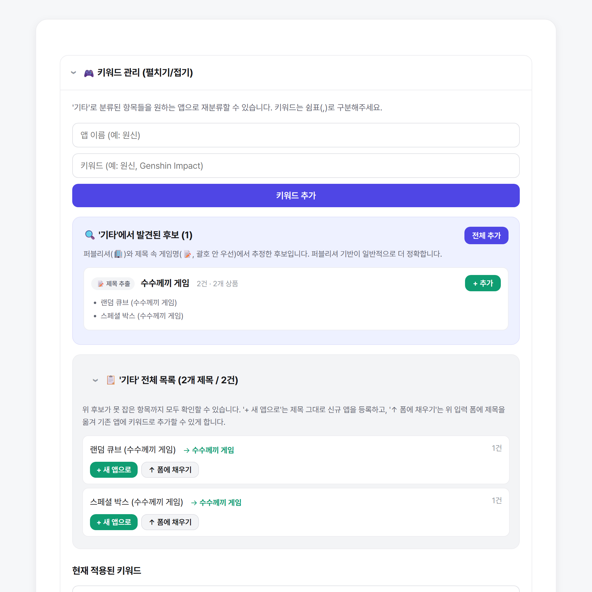
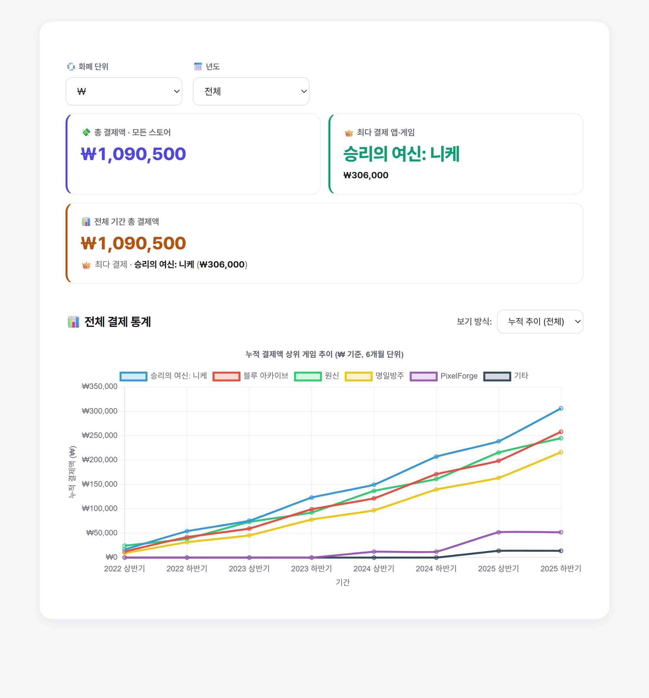

# 📑 Sort Orders · 결제 정리함

> 흩어진 결제, 한눈에 정리

Google Play / Apple App Store / 아이시움 라운지의 결제 내역 파일을 업로드하면 브라우저 안에서 게임별·월별·연도별 결제 통계를 자동으로 시각화해주는 정적 웹 앱입니다. 업로드한 파일은 어떤 서버로도 전송되지 않고 사용자의 브라우저에서만 처리됩니다.





## ✨ 주요 기능

### 📊 통합 분석 대시보드 (`index.html`)
- **세 플랫폼 통합**: Google Play(`.json`) / Apple Store(`.html`) / 아이시움 라운지(`.html`)를 한 페이지에서 함께 업로드해 전체 결제 내역을 한눈에 분석
- **SPA 모드 전환**: 상단 탭으로 통합 / Google 전용 / Apple 전용 보기를 즉시 전환
- **다중 통화 지원**: `₩`, `$`, `¥`, `€` 등 결제 내역에 포함된 통화를 자동 감지하고 선택한 통화 기준으로 모든 요약·차트·내역을 필터링
- **연도 / 게임 드릴다운**: 연도를 고르면 하단 모든 섹션이 그 연도 기준으로 재계산되고, 게임을 고르면 월별 결제 차트·전체 내역 표를 확인 가능
- **전체 통계 시각화**: 누적 추이(상·하반기 단위)와 연도별 합계 두 가지 보기 방식 제공 (Chart.js)

### 🔍 자동 키워드 추출 + '기타' 재분류
- **자동 후보 추출**: '기타'로 분류된 결제 내역에서 게임 이름 후보를 자동 추출
  - 1순위: **퍼블리셔 정보** (Apple Store HTML에서 추출, Google JSON은 `documentSubtitle` 등 가능 시)
  - 2순위: **제목 안 괄호** 내용 (예: `"데일리 공물 (트릭컬 리바이브)"` → `트릭컬 리바이브`)
  - 3순위: 구분자(`-`, `:`, `|` 등) 앞부분
- **'기타' 전체 목록 보기**: 휴리스틱이 못 잡은 항목까지 모두 시야에 노출. 행마다 `+ 새 앱으로` / `↑ 폼에 채우기` 버튼으로 빠르게 분류
- **수동 키워드 추가**: 직접 앱 이름과 키워드를 등록 가능 (쉼표로 여러 키워드 한번에 등록)

### 📅 결산 페이지 (`recap.html`)
- 업로드한 데이터에서 결제가 있는 **연도와 게임 목록을 자동 추출**해 드롭다운에 채움
- **전체 통합** 또는 **특정 게임** 단위로 결산 진행
- 전체 통합 모드에서는 **Top 7 게임 슬라이드** 추가 노출
- 슬라이드: 인트로 → 총액(다중 통화 보조 표시) → Top 7 게임 → 월별 타임라인 → 최고 지출 월 → 아웃트로
- **진행 중인 연도**를 고르면 "중간 결산", "지금까지" 같은 표현으로 자동 분기
- 월별 영수증을 **PNG 이미지로 저장** (html2canvas 활용)

### 📱 모바일 최적화
- 반응형 레이아웃, 좁은 화면에서 표가 카드형으로 자동 전환

## 🚀 사용 방법

1. 데모 사이트에 접속하거나 로컬에서 `index.html`을 엽니다.
2. 데이터 파일을 업로드합니다 (필요한 것만 올려도 OK).
   - **Google Play**: [Google Takeout](https://takeout.google.com/) → 'Google Play 스토어' → `Order History.json` 다운로드 ([가이드](guide/guide.html))
   - **Apple App Store**: [Apple 문제 신고](https://reportaproblem.apple.com/) → 전체 내역이 보일 때까지 스크롤 → 페이지 저장(HTML) ([가이드](guide/apple_guide.html))
   - **아이시움 라운지**: 트릭컬 공식 웹샵의 결제 내역 페이지 저장 ([가이드](guide/icium_guide.html))
3. 데이터가 분석되면 하단에서 차트와 상세 내역을 확인합니다.
4. `📅 결제 결산` 탭에서 슬라이드 형식의 한 해 결산을 진행할 수 있습니다.

> 키워드 관리 및 키워드 추가는 **세션 단위**입니다. 새로고침하면 사용자가 추가한 키워드는 초기화됩니다.

## 🛠 로컬에서 띄우기

빌드 단계가 없으므로 두 가지 방법 중 하나면 됩니다.

```bash
# 1) 단순히 index.html을 더블클릭해서 열거나

# 2) 정적 서버로 띄우기 (updates.json fetch 호환 등 안정적)
python -m http.server 8000
# → http://localhost:8000
```

## 🌐 GitHub Pages로 호스팅하기

이 리포지터리는 정적 사이트라 GitHub Pages로 바로 배포 가능합니다.

1. 저장소 `Settings` → `Pages`로 이동
2. Source: `Deploy from a branch` 선택
3. Branch: `main`, Folder: `/ (root)` 선택 후 **Save**
4. 1~2분 뒤 사이트 URL이 노출됩니다: `https://<username>.github.io/<repo>/`

이후 `main` 브랜치에 push만 하면 변경사항이 자동 반영됩니다.

## 🧱 기술 스택

- HTML / CSS / Vanilla JavaScript (빌드 도구 없음)
- [Chart.js](https://www.chartjs.org/) — 차트 시각화 (CDN)
- [html2canvas](https://html2canvas.hertzen.com/) — 결산 영수증 PNG 저장 (CDN)

## 📁 프로젝트 구조

```
.
├── index.html              # 통합 분석 대시보드 (SPA: all/google/apple 모드)
├── recap.html              # 결산 슬라이드 페이지 (게임 무관)
├── updates.json            # 업데이트 내역 (양쪽 페이지에서 동적 로드)
├── css/style.css           # 통합 스타일시트
├── js/
│   ├── appKeywords.js      # 게임 분류 키워드 사전 (수동 큐레이션)
│   ├── parsers.js          # Google/Apple/Icium 결제 데이터 파서
│   ├── main.js             # index.html 컨트롤러
│   └── recap.js            # recap.html 컨트롤러
├── guide/                  # 각 플랫폼 데이터 추출 가이드 HTML
├── image/                  # README/가이드 이미지 등
└── CLAUDE.md               # 코드베이스 아키텍처 문서 (AI 도구 및 신규 컨트리뷰터용)
```

## 📝 라이선스 / 이미지 자산 안내

- `image/` 폴더에는 과거 트릭컬 리바이브 결산 페이지에서 사용했던 사복 패스 / 월별 패스 이미지·영상이 일부 포함되어 있습니다. 현재 코드에서는 더 이상 참조되지 않으며, 게임 이미지의 저작권은 EPID Games에 있습니다.
- `readme01.png` ~ `readme03.png`, `playStoreCheck.png` 등의 가이드 이미지는 본 저장소가 보유합니다.
